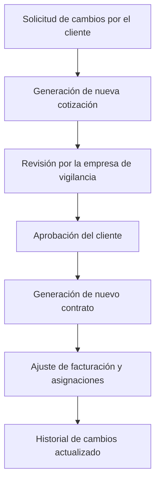

# Análisis Detallado del Sistema de Gestión de Seguridad

Borrador / v. 1.0 / Alexander Matos

## Analisis Principal del sistema
Las empresas de renta de seguridad privada enfrentan una serie de necesidades y problemas comunes a nivel global, debido a la naturaleza crítica de los servicios que ofrecen y las regulaciones específicas en cada región. Algunos de los desafíos y necesidades más destacados son:

### 1. **Cumplimiento Regulatorio y Normativo**
   - **Normas locales y certificaciones**: Las leyes de seguridad varían en cada país y, a veces, incluso entre regiones de un mismo país. Las empresas deben cumplir con estrictas normativas en cuanto a la capacitación del personal, el uso de armas, la protección de datos y la responsabilidad civil.
   - **Auditorías y verificaciones**: Para mantener la licencia de operación, las empresas deben pasar auditorías periódicas que aseguren que cumplen con los estándares de seguridad y manejo de personal.
   
### 2. **Escasez y Capacitación del Personal**
   - **Dificultad para encontrar personal capacitado**: Las empresas de seguridad privada suelen tener problemas para encontrar personal que cumpla con las habilidades requeridas, como manejo de conflictos, conocimiento en tecnología de seguridad, y la capacidad de reaccionar adecuadamente ante situaciones de emergencia.
   - **Entrenamiento constante**: El personal necesita una capacitación continua para adaptarse a nuevas tecnologías de seguridad (cámaras, sistemas de vigilancia, software de monitoreo), así como a nuevas regulaciones y protocolos de seguridad.

### 3. **Incremento de los Costos Operativos**
   - **Salarios y beneficios**: Para retener a personal cualificado, las empresas deben ofrecer salarios competitivos, lo que puede afectar los márgenes de ganancia, especialmente en economías con inflación o alto costo de vida.
   - **Inversiones en tecnología**: Las empresas deben mantenerse actualizadas con las últimas soluciones tecnológicas en seguridad, como drones de vigilancia, inteligencia artificial para monitoreo, y sistemas de control de acceso. Estas inversiones elevan los costos iniciales y de mantenimiento.
  
### 4. **Integración de Nuevas Tecnologías**
   - **Automatización y software de gestión**: Existe una necesidad creciente de sistemas integrados que faciliten la administración de las operaciones diarias, como la gestión del personal, la programación de turnos y el monitoreo en tiempo real de las actividades.
   - **Seguridad cibernética**: A medida que las empresas de seguridad adoptan tecnologías digitales, deben protegerse contra ataques cibernéticos que podrían comprometer datos sensibles o afectar los sistemas de monitoreo y control de acceso.

### 5. **Gestión de Riesgos y Responsabilidad Civil**
   - **Riesgos de responsabilidad**: Las empresas de seguridad están expuestas a riesgos altos, como demandas por uso excesivo de la fuerza, negligencia o fallas en los servicios de seguridad que resulten en robos o daños.
   - **Seguros y cobertura legal**: Las empresas deben contar con pólizas de seguros adecuadas que cubran incidentes relacionados con la seguridad y la protección del personal, lo que puede ser costoso.

### 6. **Competencia y Precios**
   - **Competencia feroz**: El mercado de la seguridad privada es altamente competitivo, lo que a menudo obliga a las empresas a reducir precios para ganar contratos, afectando sus márgenes de ganancia.
   - **Segmentación de clientes**: Las necesidades de seguridad varían significativamente entre clientes corporativos, residenciales, comerciales y gubernamentales, lo que exige que las empresas ofrezcan servicios personalizados que se ajusten a cada segmento.

### 7. **Control de Calidad y Supervisión**
   - **Monitoreo de desempeño**: Asegurarse de que el personal esté cumpliendo con los estándares de servicio es crucial. Sin un buen sistema de supervisión, la calidad del servicio puede verse afectada.
   - **Feedback del cliente**: La satisfacción del cliente es clave, y las empresas deben implementar mecanismos de retroalimentación para ajustar sus servicios según las expectativas y necesidades del cliente.

### 8. **Adaptación a las Amenazas Cambiantes**
   - **Nuevos tipos de amenazas**: El aumento de amenazas cibernéticas, terrorismo y crimen organizado obliga a las empresas de seguridad privada a adaptarse rápidamente para ofrecer soluciones efectivas. Esto requiere una mejora continua en las capacidades de análisis de riesgos y la respuesta ante emergencias.
  
En resumen, las empresas de seguridad privada enfrentan un ambiente de alta competencia, costos crecientes, regulaciones estrictas, y una demanda cada vez más alta de servicios más sofisticados y tecnológicos. La gestión eficaz del personal, la integración tecnológica y la adaptación a las nuevas amenazas son algunas de las claves para el éxito en este sector.

## Normativas y Requisitos

En la República Dominicana, las empresas de seguridad privada están reguladas por leyes y normativas específicas que buscan garantizar que estas operen de manera legal y responsable, protegiendo tanto a sus clientes como al personal que contratan. Algunas de las principales normativas y requisitos son los siguientes:

### 1. **Ley General de Seguridad Privada (Ley No. 631-16)**
   - Esta ley regula las actividades de las empresas de seguridad privada en el país, estableciendo los requisitos para su funcionamiento, la supervisión del personal y las sanciones por incumplimiento.
   - La ley establece que todas las empresas de seguridad privada deben estar registradas y autorizadas por el Ministerio de Interior y Policía.

### 2. **Registro y Autorización de Operación**
   - **Licencia de operación**: Todas las empresas de seguridad deben obtener una licencia emitida por el Ministerio de Interior y Policía, la cual es obligatoria para operar de manera legal.
   - **Evaluación previa**: Para obtener la licencia, la empresa debe cumplir con una serie de requisitos que incluyen la presentación de documentación que pruebe la solvencia económica, el cumplimiento de normas legales, y un plan de negocio detallado.
   
### 3. **Certificación del Personal de Seguridad**
   - **Capacitación y entrenamiento**: El personal de seguridad debe recibir capacitación en centros certificados por el Ministerio de Interior y Policía. La formación incluye el uso de armas (si aplica), procedimientos de emergencia, control de multitudes y conocimientos en leyes nacionales sobre seguridad.
   - **Permiso de portación de armas**: Para aquellos guardias que portan armas, es necesario obtener un permiso específico de portación, el cual también es gestionado por el Ministerio de Interior y Policía. El personal debe pasar por exámenes psicológicos y pruebas de manejo de armas.

### 4. **Supervisión y Control del Ministerio de Interior y Policía**
   - **Supervisión periódica**: El Ministerio de Interior y Policía está encargado de llevar a cabo inspecciones periódicas para verificar que las empresas cumplan con las normativas vigentes.
   - **Revisión de antecedentes**: Las empresas deben proporcionar información sobre los antecedentes penales de sus empleados como parte del proceso de selección y contratación, y someterlos a evaluaciones de seguridad.
   
### 5. **Regulación del Uso de Armas**
   - **Control y registro de armas**: Las armas utilizadas por las empresas de seguridad privada deben estar debidamente registradas ante el Ministerio de Interior y Policía. El uso indebido de las armas está sujeto a sanciones y, en casos graves, la suspensión de la licencia de la empresa.
   - **Prohibición de armas no autorizadas**: Las empresas no pueden utilizar armas que no hayan sido previamente autorizadas o que estén fuera de los controles de las autoridades competentes.

### 6. **Responsabilidad Civil y Seguros**
   - **Seguro de responsabilidad civil**: Las empresas de seguridad privada están obligadas a contar con un seguro de responsabilidad civil que cubra daños a terceros, ya sea por incidentes relacionados con el servicio o por negligencia en el cumplimiento de sus funciones.
   - **Cobertura de riesgos laborales**: También deben asegurar que sus empleados estén cubiertos por un seguro de riesgos laborales, protegiéndolos en caso de lesiones o incidentes en el ejercicio de sus funciones.

### 7. **Regulación sobre Protección de Datos y Privacidad**
   - Dado que las empresas de seguridad manejan información sensible sobre sus clientes, están obligadas a cumplir con normativas relacionadas con la protección de datos, en línea con la Ley No. 172-13 sobre Protección de Datos Personales. Esto incluye la obligación de garantizar que la información recopilada en la prestación del servicio se mantenga confidencial.

### 8. **Uso de Tecnología de Vigilancia**
   - Las empresas que utilicen sistemas tecnológicos como cámaras de vigilancia, dispositivos de monitoreo y control de acceso deben garantizar que estas tecnologías se utilicen de manera legal y ética, respetando la privacidad de los ciudadanos.
   - En algunos casos, las autoridades pueden requerir que las empresas entreguen grabaciones de cámaras o informes de vigilancia como parte de una investigación oficial.

### 9. **Reglamento para la Prestación de Servicios de Seguridad en Eventos Especiales**
   - Existen normativas específicas para la prestación de servicios de seguridad en eventos masivos o especiales (conciertos, eventos deportivos, etc.). Las empresas deben presentar un plan de seguridad aprobado por el Ministerio de Interior y Policía que cubra todos los aspectos del evento, incluyendo la distribución del personal, la comunicación y los procedimientos de emergencia.

### 10. **Sanciones por Incumplimiento**
   - **Multas y sanciones**: El incumplimiento de las normativas puede resultar en multas económicas, la suspensión temporal de las operaciones, o en casos graves, la revocación definitiva de la licencia de operación.
   - **Responsabilidad penal**: Si se demuestra que una empresa de seguridad ha actuado con negligencia o ha participado en actividades ilícitas, sus directivos y empleados pueden ser procesados penalmente.

### Organismo Regulador Principal:
- **Ministerio de Interior y Policía**: Es la entidad encargada de regular, autorizar, supervisar y sancionar a las empresas de seguridad privada en la República Dominicana. También lleva el registro de las empresas y su personal, así como de las armas que estas utilizan.

En resumen, las empresas de seguridad privada en la República Dominicana deben cumplir con una serie de normativas que van desde la obtención de licencias y la capacitación del personal, hasta la implementación de medidas de control para el uso de armas y la protección de datos. Las autoridades, especialmente el Ministerio de Interior y Policía, supervisan el cumplimiento de estas normas y aplican sanciones en caso de incumplimiento.

## Soluciones Tecnológicas

Las empresas de seguridad privada enfrentan numerosos desafíos en la gestión de sus operaciones diarias, que incluyen la gestión de personal, la supervisión de actividades, el cumplimiento normativo, y la administración de recursos tecnológicos. Existen diversas soluciones informáticas diseñadas específicamente para abordar estos procesos y requerimientos, proporcionando automatización, eficiencia y mayor control sobre las operaciones. A continuación, te detallo algunas de las principales soluciones tecnológicas orientadas a este sector:

### 1. **Sistemas de Gestión de Seguridad (Security Management Systems - SMS)**
   - **Características principales**: 
     - Gestión de guardias y equipos de seguridad.
     - Programación de turnos y asignación de personal.
     - Supervisión en tiempo real de las operaciones.
     - Integración con cámaras de vigilancia, sistemas de alarmas y control de acceso.
   - **Beneficios**: Estos sistemas permiten a las empresas de seguridad optimizar la administración de recursos y personal, garantizando que las operaciones de vigilancia se realicen de manera eficiente y cumpliendo con las normativas. Además, ofrecen seguimiento en tiempo real y reportes de actividades.

   **Ejemplos de software**:  
   - **Trackforce Valiant**: Ofrece herramientas de gestión de personal, programación de guardias, generación de reportes, y seguimiento de patrullas en tiempo real.
   - **Silvertrac**: Un sistema de gestión de seguridad que permite a los supervisores y guardias reportar incidentes, controlar rondas de vigilancia y gestionar tareas desde dispositivos móviles.

### 2. **Sistemas de Control de Acceso y Vigilancia**
   - **Características principales**:
     - Control de acceso biométrico (huella digital, reconocimiento facial).
     - Integración con cámaras de seguridad y sistemas de alarma.
     - Monitorización en tiempo real y almacenamiento de grabaciones.
   - **Beneficios**: Estas soluciones permiten a las empresas de seguridad gestionar el acceso a instalaciones de manera automatizada y segura, además de realizar la vigilancia de grandes áreas de forma eficiente.

   **Ejemplos de software y hardware**:  
   - **Genetec Security Center**: Una plataforma que unifica videovigilancia, control de acceso y sistemas de reconocimiento automático de matrículas (ALPR) en una sola interfaz.
   - **Hikvision**: Líder en cámaras de vigilancia y sistemas de grabación, ofrece soluciones integradas para el control de acceso y la seguridad electrónica.

### 3. **Sistemas de Gestión de Personal y Nómina**
   - **Características principales**:
     - Registro de horas de trabajo (time tracking).
     - Generación automática de nóminas y pago de salarios.
     - Gestión de permisos, ausencias y vacaciones.
     - Evaluación del desempeño del personal.
   - **Beneficios**: Facilitan el manejo eficiente de recursos humanos y la optimización de los costos operativos, lo que es crucial en empresas de seguridad con grandes cantidades de empleados distribuidos en diferentes turnos y ubicaciones.

   **Ejemplos de software**:
   - **BambooHR**: Una plataforma de recursos humanos que facilita la gestión de empleados, el seguimiento del tiempo trabajado y la generación de informes de nómina.
   - **ADP Workforce Now**: Software de gestión de personal y nóminas que se adapta a las necesidades específicas de las empresas de seguridad, especialmente aquellas con gran cantidad de empleados.

### 4. **Sistemas de Gestión de Incidentes**
   - **Características principales**:
     - Reporte de incidentes en tiempo real mediante dispositivos móviles.
     - Seguimiento y registro detallado de eventos de seguridad.
     - Generación de informes y análisis de patrones de riesgo.
   - **Beneficios**: Estas soluciones permiten a los guardias y supervisores documentar incidentes de manera rápida y precisa, lo que mejora la capacidad de respuesta ante eventos críticos y optimiza el manejo de la información de seguridad.

   **Ejemplos de software**:
   - **Incident Tracker**: Un sistema especializado en la gestión de incidentes que permite a las empresas de seguridad registrar y monitorear eventos de seguridad en tiempo real.
   - **Resolver Incident Management**: Proporciona herramientas para registrar, investigar y analizar incidentes de seguridad, permitiendo una respuesta ágil y eficiente.

### 5. **Plataformas de Monitoreo y Gestión de Alarmas**
   - **Características principales**:
     - Monitoreo de alarmas en tiempo real.
     - Integración con sistemas de control de acceso y cámaras de seguridad.
     - Alerta automatizada a los supervisores y personal de seguridad en caso de incidentes.
   - **Beneficios**: Facilitan la vigilancia remota de instalaciones y permiten a las empresas de seguridad responder rápidamente a situaciones críticas, reduciendo el tiempo de reacción ante emergencias.

   **Ejemplos de software**:
   - **Immix**: Una plataforma que permite la centralización del monitoreo de alarmas, videos y otros sistemas de seguridad en una sola interfaz.
   - **Bold Technologies Manitou**: Un sistema de monitoreo integral que soporta la gestión de alarmas, video vigilancia, acceso y sistemas de detección de incendios.

### 6. **Sistemas de Localización GPS y Gestión de Flotas**
   - **Características principales**:
     - Seguimiento de vehículos en tiempo real.
     - Rutas optimizadas y alertas de seguridad.
     - Informes detallados de uso del vehículo y eficiencia del combustible.
   - **Beneficios**: Estas soluciones son vitales para las empresas que operan vehículos de patrulla, permitiendo optimizar las rutas, mejorar la eficiencia operativa y garantizar que las patrullas se realicen en las zonas asignadas.

   **Ejemplos de software**:
   - **Geotab**: Una plataforma avanzada de gestión de flotas y seguimiento GPS que ayuda a las empresas de seguridad a optimizar sus operaciones de patrullaje.
   - **Samsara**: Solución integral que combina gestión de flotas, monitoreo de conductores y seguimiento de activos para garantizar la seguridad y eficiencia en el transporte.

### 7. **Sistemas de Ciberseguridad**
   - **Características principales**:
     - Protección contra ataques cibernéticos en sistemas de seguridad.
     - Encriptación de datos y gestión segura de la información.
     - Monitoreo y análisis de tráfico de red para detectar amenazas.
   - **Beneficios**: Con el aumento de la digitalización, las empresas de seguridad deben proteger sus infraestructuras tecnológicas de ataques cibernéticos que puedan comprometer datos sensibles o sistemas de control.

   **Ejemplos de software**:
   - **Fortinet**: Proveedor líder en soluciones de ciberseguridad, que ofrece protección contra amenazas avanzadas para las empresas de seguridad que gestionan redes, cámaras y otros dispositivos conectados.
   - **Palo Alto Networks**: Proporciona soluciones de firewall de nueva generación y gestión de riesgos cibernéticos para proteger las infraestructuras de seguridad.

### 8. **Soluciones de Cumplimiento Normativo**
   - **Características principales**:
     - Gestión y seguimiento de licencias y certificaciones.
     - Monitoreo del cumplimiento normativo y auditorías.
     - Informes detallados sobre cumplimiento de regulaciones de seguridad y normativas laborales.
   - **Beneficios**: Aseguran que las empresas de seguridad cumplan con las leyes y regulaciones locales e internacionales, evitando sanciones legales y mejorando la confianza del cliente.

   **Ejemplos de software**:
   - **ComplyWorks**: Una plataforma de gestión del cumplimiento normativo que permite a las empresas de seguridad gestionar contratos, licencias, y auditorías.
   - **iAuditor**: Un software que facilita la realización de auditorías de cumplimiento y genera informes automáticos para garantizar que las empresas de seguridad cumplan con las normativas.

En resumen, las empresas de seguridad privada pueden beneficiarse enormemente del uso de soluciones tecnológicas que cubren aspectos clave como la gestión de personal, monitoreo en tiempo real, cumplimiento normativo, ciberseguridad y gestión de incidentes. Estas herramientas no solo mejoran la eficiencia operativa, sino que también aumentan la capacidad de respuesta ante emergencias y la satisfacción del cliente.

Aquí te presento una tabla simplificada que describe las soluciones de software para empresas de seguridad, incluyendo el costo promedio, la dificultad de implementación, las integraciones y los estándares en los que se basan:

| **Solución de Software**      | **Costo Promedio**      | **Dificultad de Implementación** | **Integraciones**                                                                                              | **Estándares en los que se basa**                                                                            |
|-------------------------------|-------------------------|----------------------------------|---------------------------------------------------------------------------------------------------------------|----------------------------------------------------------------------------------------------------------------|
| **Trackforce Valiant**         | $50 - $100 por usuario/mes | Media                           | Sistemas de control de acceso, cámaras de seguridad, nómina, ERP                                                | ISO 27001 (Seguridad de la Información), SOC 2 (Controles de Seguridad y Privacidad)                            |
| **Silvertrac**                 | $30 - $75 por usuario/mes | Baja                            | GPS, informes móviles, cámaras de vigilancia, control de acceso                                                  | ISO 27001, GDPR (Protección de datos)                                                                           |
| **Genetec Security Center**    | $100 - $300 por instalación | Alta                            | Control de acceso, videovigilancia, ALPR, sensores IoT                                                           | ONVIF (Open Network Video Interface Forum), ISO 27001                                                           |
| **Hikvision**                  | Varía según hardware     | Media                           | Cámaras de vigilancia, sistemas de alarma, control de acceso                                                     | ONVIF, ISO 9001 (Calidad)                                                                                       |
| **BambooHR**                   | $6 - $8 por usuario/mes  | Baja                            | Nómina, ERP, plataformas de gestión de personal                                                                  | ISO 27001, SOC 2                                                                                                |
| **ADP Workforce Now**          | $50 - $200 por usuario/mes | Media                           | Nómina, sistemas de tiempo y asistencia, CRM                                                                     | GDPR, FLSA (Ley de Normas Laborales Justas en EE.UU.), SOC 1/SOC 2                                              |
| **Incident Tracker**           | $10 - $40 por usuario/mes | Baja                            | CRM, sistemas de notificaciones móviles, integraciones de correo electrónico                                      | ISO 27001, SOC 2                                                                                                |
| **Resolver Incident Management**| $20 - $50 por usuario/mes | Media                           | Sistemas de notificaciones, cámaras de seguridad, ERP                                                            | ISO 31000 (Gestión de Riesgos), SOC 2                                                                           |
| **Immix**                      | $500 - $2,000 por instalación | Alta                            | Cámaras, control de acceso, sistemas de alarmas, IoT                                                             | UL 827 (Central Station Alarm Services), ISO 27001                                                              |
| **Bold Technologies Manitou**  | $300 - $2,500 por instalación | Alta                            | Sistemas de alarmas, control de acceso, cámaras de vigilancia                                                    | ISO 27001, UL 1981 (Sistemas de Monitoreo de Seguridad)                                                         |
| **Geotab**                     | $20 - $50 por vehículo/mes | Media                           | GPS, gestión de flotas, control de combustible, sistemas de diagnóstico del vehículo                             | ISO 14001 (Gestión Ambiental), ISO 27001                                                                        |
| **Samsara**                    | $30 - $100 por vehículo/mes | Alta                            | GPS, sistemas de cámara a bordo, gestión de flotas, monitoreo de conductores                                     | ISO 27001, DOT (Department of Transportation en EE.UU.)                                                         |
| **Fortinet**                   | $1,000 - $5,000 por instalación | Alta                            | Firewalls, VPN, monitorización de tráfico, protección contra malware                                             | ISO 27001, NIST SP 800-53 (Controles de Seguridad)                                                              |
| **Palo Alto Networks**         | $500 - $3,000 por instalación | Alta                            | Firewalls de nueva generación, VPN, prevención de intrusiones                                                    | ISO 27001, GDPR, NIST SP 800-53                                                                                 |
| **ComplyWorks**                | $10 - $50 por usuario/mes | Media                           | ERP, CRM, herramientas de gestión de proyectos                                                                  | ISO 19600 (Compliance Management), ISO 27001                                                                    |
| **iAuditor**                   | $19 - $39 por usuario/mes  | Baja                            | ERP, CRM, sistemas de reportes móviles, almacenamiento en la nube                                                | ISO 9001, ISO 45001 (Salud y Seguridad Ocupacional)                                                             |

### **Leyenda:**
- **Costo Promedio**: Este es el costo aproximado por usuario o por instalación según la solución.
- **Dificultad de Implementación**: Se refiere a la complejidad técnica y el tiempo requerido para implementar la solución (Baja, Media, Alta).
- **Integraciones**: Las soluciones pueden conectarse con diferentes tipos de sistemas como cámaras de seguridad, sistemas de control de acceso, ERPs, etc.
- **Estándares**: Incluyen las normas internacionales de seguridad, privacidad y calidad en las que se basan las soluciones para cumplir con las regulaciones y mejores prácticas del sector.

Esta tabla proporciona una visión general para facilitar la comparación y evaluación de diferentes soluciones informáticas orientadas a las empresas de seguridad.

## Principales Empresas de Seguridad Privada en República Dominicana

En la República Dominicana, el sector de la seguridad privada ha crecido significativamente debido a la demanda de servicios de protección tanto para empresas como para particulares. A continuación, te menciono algunas de las principales empresas de seguridad privada que operan en el país:

### **1. G4S Dominicana**
   - **Descripción**: Parte de G4S, una de las compañías de seguridad más grandes del mundo. Ofrecen servicios de seguridad física, vigilancia electrónica, y transporte de valores.
   - **Servicios**: Seguridad física, seguridad electrónica, monitoreo de alarmas, transporte de valores, gestión de riesgos.

### **2. Grupo Prosegur**
   - **Descripción**: Empresa internacional de origen español con presencia en República Dominicana. Prosegur se especializa en servicios de seguridad integral.
   - **Servicios**: Vigilancia física, gestión de efectivo, tecnología en seguridad, soluciones de seguridad corporativa.

### **3. Guardianes de Seguridad (GUARDSA)**
   - **Descripción**: Empresa de seguridad dominicana que ofrece una amplia gama de servicios de protección y seguridad a nivel corporativo y residencial.
   - **Servicios**: Vigilancia, escoltas, instalación de sistemas de cámaras y alarmas, patrullaje.

### **4. Sociedad Dominicana de Seguridad, S.A. (SODOSISA)**
   - **Descripción**: Empresa que lleva varios años en el sector de la seguridad en el país, especializada en servicios de vigilancia y protección.
   - **Servicios**: Vigilancia física, monitoreo de alarmas, instalación de sistemas de seguridad.

### **5. Seguridad Confianza (SEGURCONSA)**
   - **Descripción**: Empresa dominicana que ofrece una variedad de soluciones de seguridad tanto para clientes residenciales como comerciales.
   - **Servicios**: Vigilancia física, monitoreo de alarmas, patrullaje móvil, asesoría en seguridad.

### **6. ESS Dominicana**
   - **Descripción**: Empresa de seguridad que ofrece servicios integrales con enfoque en tecnología avanzada para la seguridad.
   - **Servicios**: Sistemas de control de acceso, videovigilancia, monitoreo de alarmas, seguridad física.

### **7. Watchman Security**
   - **Descripción**: Una empresa local con un enfoque en la protección y vigilancia personalizada para empresas y hogares.
   - **Servicios**: Guardias de seguridad, videovigilancia, control de acceso, sistemas de alarma.

### **8. Servi-Protec**
   - **Descripción**: Empresa de seguridad dominicana enfocada en brindar protección a nivel empresarial y residencial.
   - **Servicios**: Vigilancia privada, instalación de sistemas de cámaras de seguridad, patrullas.

### **9. Seprisa (Servicios Privados de Seguridad)**
   - **Descripción**: Una de las empresas más antiguas en el sector de seguridad privada en República Dominicana, con una sólida trayectoria en protección.
   - **Servicios**: Vigilancia, escoltas armados, protección de eventos, control de acceso.

### **10. Security Force Dominicana**
   - **Descripción**: Proporciona servicios de vigilancia y protección con personal entrenado en la seguridad física de instalaciones comerciales y residenciales.
   - **Servicios**: Vigilancia armada, sistemas de monitoreo y alarmas, patrullaje.

Estas empresas ofrecen una variedad de servicios para satisfacer las necesidades de seguridad de diferentes sectores, incluyendo vigilancia física, sistemas tecnológicos de seguridad, monitoreo de alarmas, escoltas, y más.

Aquí tienes un cuadro resumido con los diferentes tipos de servicios de seguridad que ofrecen las principales empresas de seguridad privada en la República Dominicana, con columnas que incluyen la definición del servicio, módulos o características específicas:

| **Tipo de Servicio**          | **Definición del Servicio**                                           | **Empresas que lo Ofrecen**                                   | **Módulos o Características Específicas**                                            |
|-------------------------------|----------------------------------------------------------------------|----------------------------------------------------------------|-------------------------------------------------------------------------------------|
| **Vigilancia Física**          | Protección de instalaciones con personal de seguridad entrenado.     | G4S, Prosegur, GUARDSA, SODOSISA, SEGURCONSA, ESS Dominicana, Watchman Security, Servi-Protec, Seprisa, Security Force Dominicana | Guardias armados o desarmados, rotación de turnos, control de entradas y salidas, patrullaje interno. |
| **Monitoreo de Alarmas**       | Supervisión remota de sistemas de alarma en tiempo real.             | G4S, Prosegur, GUARDSA, SEGURCONSA, ESS Dominicana, Watchman Security | Monitoreo 24/7, respuesta rápida ante alarmas, integración con cámaras y control de acceso. |
| **Sistemas de Videovigilancia**| Instalación y gestión de cámaras de seguridad para monitoreo continuo.| G4S, Prosegur, GUARDSA, SEGURCONSA, ESS Dominicana, Watchman Security, Servi-Protec | Cámaras IP, grabación en la nube, acceso remoto, cámaras PTZ, integración con sistemas de alarmas. |
| **Control de Acceso**          | Gestión y control de acceso a instalaciones mediante tecnología.      | Prosegur, SEGURCONSA, ESS Dominicana, Watchman Security        | Control biométrico, tarjetas RFID, control de acceso remoto, integración con videovigilancia y alarmas. |
| **Transporte de Valores**      | Protección y transporte seguro de efectivo y bienes de alto valor.   | G4S, Prosegur                                                  | Vehículos blindados, escoltas armadas, cajas fuertes móviles, monitoreo GPS en tiempo real. |
| **Gestión de Efectivo**        | Manejo y custodia de efectivo para empresas, bancos o instituciones. | Prosegur, G4S                                                   | Procesamiento de depósitos, recaudación de efectivo, auditoría y contabilización, reportes diarios. |
| **Patrullaje Móvil**           | Supervisión de zonas específicas mediante vehículos de seguridad.     | GUARDSA, SEGURCONSA, Watchman Security, Seprisa, Security Force Dominicana | Vehículos de patrulla, rondas de supervisión, GPS en tiempo real, reacción rápida ante incidentes. |
| **Escoltas**                  | Acompañamiento y protección de personas o bienes durante traslados.  | Prosegur, G4S, Seprisa                                          | Escoltas armados, planificación de rutas seguras, vehículos de escolta blindados, comunicación en tiempo real. |
| **Asesoría en Seguridad**      | Consultoría para la implementación de soluciones de seguridad.        | G4S, Prosegur, SEGURCONSA                                       | Evaluación de riesgos, diseño de planes de seguridad, informes y recomendaciones, simulacros de seguridad. |
| **Protección de Eventos**      | Seguridad en eventos masivos, corporativos o privados.               | Seprisa, Servi-Protec                                           | Guardias de seguridad especializados, control de multitudes, sistemas de control de acceso temporal, monitoreo de áreas críticas. |
| **Instalación de Sistemas de Seguridad**| Implementación de tecnología de seguridad como cámaras y alarmas. | G4S, Prosegur, GUARDSA, Watchman Security, ESS Dominicana, Servi-Protec | Instalación de cámaras de vigilancia, alarmas antirrobo, sensores de movimiento, integración de sistemas con control de acceso. |
| **Protección Residencial**     | Seguridad específica para residencias o complejos habitacionales.    | G4S, GUARDSA, Watchman Security, Servi-Protec, Security Force Dominicana | Guardias residenciales, patrullaje en complejos, monitoreo de alarmas, acceso de visitantes controlado. |
| **Ciberseguridad**             | Protección de redes y sistemas de información contra ataques digitales.| G4S, Prosegur                                                   | Firewall, detección de intrusos, análisis de vulnerabilidades, protección de datos, seguridad en la nube. |

### **Explicación de las Columnas:**
- **Definición del Servicio**: Proporciona una breve descripción del servicio en cuestión, detallando su finalidad principal.
- **Empresas que lo Ofrecen**: Lista las empresas de seguridad en República Dominicana que ofrecen cada tipo de servicio.
- **Módulos o Características Específicas**: Describe los elementos o características específicos que forman parte de cada servicio, como el uso de tecnología o las herramientas de gestión utilizadas.

Este cuadro te ofrece una visión clara y estructurada de los servicios de seguridad que las empresas del país pueden ofrecer, incluyendo los módulos tecnológicos y operativos clave.

## Proceso de Cotización, Aprobación y Puesta en Marcha para el Servicio de Manejo de Efectivo

El proceso de **cotización, aprobación y puesta en marcha** para el **servicio de manejo de efectivo** dirigido a un banco en la República Dominicana involucra varias etapas clave. A continuación se detalla cada una de ellas, los documentos necesarios y los procesos involucrados:

### 1. **Solicitud de Cotización**
   - **Descripción**: El banco interesado en contratar el servicio de manejo de efectivo solicita formalmente una cotización a la empresa de seguridad especializada en este servicio (como Prosegur o G4S).
   - **Documentos Intervinientes**:
     - **Carta de Solicitud**: Documento formal del banco solicitando la cotización del servicio, incluyendo el alcance deseado.
     - **Requisitos del Cliente**: Especificaciones del banco sobre los servicios que necesita, tales como recolección diaria de efectivo, transporte a bóvedas, etc.
     - **Datos Financieros**: Detalles de las sucursales del banco, volumen estimado de efectivo, rutas para la recolección, horarios, y ubicación de los puntos de entrega.
   - **Procesos**:
     - **Evaluación Inicial**: La empresa de seguridad evalúa los requisitos del banco y analiza la viabilidad del servicio, considerando aspectos logísticos como cantidad de personal, vehículos blindados, y rutas seguras.
     - **Análisis de Riesgo**: Se realiza un análisis preliminar de los riesgos asociados al transporte de efectivo y su manejo, tomando en cuenta la seguridad de las rutas y los puntos de entrega.

### 2. **Presentación de la Cotización**
   - **Descripción**: La empresa de seguridad proporciona al banco una propuesta formal que incluye costos, cronograma, condiciones del servicio y términos del contrato.
   - **Documentos Intervinientes**:
     - **Propuesta Comercial**: Documento que detalla los costos estimados (mensuales, por transacción o por evento), tiempo de respuesta, y personal asignado.
     - **Acuerdo de Confidencialidad (NDA)**: Documento que garantiza la confidencialidad de la información entre ambas partes durante las negociaciones.
     - **Especificaciones del Servicio**: Documento técnico que describe los servicios a proveer, tales como número de recolecciones diarias, el tipo de seguridad (escoltas armadas, vehículos blindados), y las condiciones de monitoreo.
   - **Procesos**:
     - **Negociación**: Ambas partes discuten los términos del servicio, buscando llegar a un acuerdo en cuanto a costos, tiempos y condiciones de seguridad.
     - **Revisión de Costos**: El banco puede revisar y comparar los costos propuestos con otras ofertas en el mercado.

### 3. **Aprobación del Servicio**
   - **Descripción**: El banco revisa la cotización presentada y aprueba o rechaza el servicio, basándose en su presupuesto y las condiciones de seguridad ofrecidas.
   - **Documentos Intervinientes**:
     - **Orden de Compra/Contrato**: Documento formal donde el banco aprueba la cotización y contrata a la empresa de seguridad para prestar el servicio.
     - **Revisión Legal**: El departamento legal del banco revisa el contrato para asegurar que cumple con las normativas y regula aspectos críticos como penalidades por incumplimiento, seguros y confidencialidad.
   - **Procesos**:
     - **Aprobación Interna del Banco**: Revisión y aprobación por el comité financiero y de seguridad del banco.
     - **Firma del Contrato**: Una vez revisado y aprobado, ambas partes firman el contrato formalizando el acuerdo.

### 4. **Puesta en Marcha del Servicio**
   - **Descripción**: Después de la aprobación, se inician los preparativos logísticos y operativos para poner en marcha el servicio de manejo de efectivo.
   - **Documentos Intervinientes**:
     - **Plan Operativo**: Documento detallado con las rutas de recolección, el personal asignado, la frecuencia de los servicios, y los protocolos de seguridad a seguir.
     - **Certificados de Seguridad**: La empresa de seguridad proporciona certificados que garantizan que los vehículos y el personal cumplen con las normativas de seguridad necesarias (vehículos blindados, entrenamiento del personal).
     - **Documentación de Seguros**: Póliza de seguro que cubre el transporte de efectivo y la responsabilidad de la empresa de seguridad.
     - **Cronograma de Servicios**: Documento con el plan de acción de recolección y entrega del efectivo, incluyendo tiempos y ubicaciones.
   - **Procesos**:
     - **Reclutamiento y Entrenamiento**: Selección del personal encargado de la recolección de efectivo y escoltas. Todos deben pasar por entrenamiento en seguridad y manejo de efectivo.
     - **Asignación de Recursos**: Asignación de vehículos blindados, escoltas y tecnologías como GPS para rastrear las rutas de transporte.
     - **Pruebas de Seguridad**: Simulacros y pruebas de las rutas para asegurar que el transporte de efectivo se realiza de manera segura.
     - **Integración de Sistemas**: Si se trata de un servicio avanzado, puede implicar la integración de los sistemas de monitoreo del banco con los de la empresa de seguridad para facilitar la trazabilidad y seguimiento en tiempo real.

### 5. **Operación Continua y Monitoreo**
   - **Descripción**: Una vez que el servicio está en marcha, el banco y la empresa de seguridad monitorean continuamente la ejecución del servicio.
   - **Documentos Intervinientes**:
     - **Reportes Diarios**: Documentos que detallan las transacciones realizadas, las cantidades de efectivo transportadas, y cualquier incidente que haya ocurrido durante el proceso.
     - **Auditorías**: Revisiones periódicas para asegurar que se cumplan los estándares de seguridad y los términos contractuales.
   - **Procesos**:
     - **Monitoreo GPS en Tiempo Real**: Rastrear los vehículos de transporte para asegurar el cumplimiento de las rutas y la seguridad del efectivo.
     - **Auditoría de Seguridad**: Revisiones continuas para identificar posibles riesgos o fallas en el proceso de manejo de efectivo.

### Resumen del Proceso:

| **Etapa**                        | **Documentos**                                                                                           | **Procesos**                                                                                        |
|-----------------------------------|---------------------------------------------------------------------------------------------------------|----------------------------------------------------------------------------------------------------|
| Solicitud de Cotización           | Carta de Solicitud, Requisitos del Cliente, Datos Financieros                                             | Evaluación Inicial, Análisis de Riesgo                                                              |
| Presentación de la Cotización     | Propuesta Comercial, Acuerdo de Confidencialidad, Especificaciones del Servicio                           | Negociación, Revisión de Costos                                                                     |
| Aprobación del Servicio           | Orden de Compra/Contrato, Revisión Legal                                                                  | Aprobación Interna del Banco, Firma del Contrato                                                    |
| Puesta en Marcha del Servicio     | Plan Operativo, Certificados de Seguridad, Documentación de Seguros, Cronograma de Servicios               | Reclutamiento y Entrenamiento, Asignación de Recursos, Pruebas de Seguridad, Integración de Sistemas |
| Operación Continua y Monitoreo    | Reportes Diarios, Auditorías                                                                             | Monitoreo GPS en Tiempo Real, Auditoría de Seguridad                                                |

Este flujo asegura que se cumplan todos los estándares de seguridad y operativos, desde la solicitud inicial hasta la operación diaria del servicio de manejo de efectivo.

## Modelo de Contrato para el Servicio de Manejo de Efectivo

Sí, para el **servicio de manejo de efectivo** entre un banco y una empresa de seguridad privada, la **creación de un contrato** es esencial. Este documento regula todos los aspectos operativos, financieros y legales del acuerdo, asegurando que ambas partes tengan claras sus responsabilidades y derechos. El contrato también establece las condiciones bajo las cuales puede ser modificado y los procedimientos para cualquier cambio que deba realizarse.

### **Modificación del Contrato**
Una vez que el contrato ha sido firmado y está en vigor, pueden surgir situaciones que requieran modificarlo. Esto se puede hacer mediante una **adenda o anexo** al contrato original, que puede incluir ajustes en:
- **Condiciones del servicio**: Cambio en la frecuencia de recolección o rutas.
- **Costos**: Modificación de tarifas debido a inflación o aumento del volumen de efectivo a manejar.
- **Condiciones de seguridad**: Incorporación de nuevas tecnologías de seguridad o cambios en los requisitos de escoltas.
- **Duración del contrato**: Extensión o reducción de la vigencia del servicio.

## PROCESO DE MODIFICACION DE CONTRATO
Para gestionar las modificaciones en un contrato aprobado tras una cotización, el sistema debe ser flexible y permitir cambios sin comprometer los términos iniciales. A continuación, te explico cómo se puede estructurar este proceso:

### 1. **Módulo de Modificación de Contratos Activos**
   - **Estado del Contrato**: El contrato inicialmente aprobado quedará marcado como **"activo"** y permitirá modificaciones mientras esté vigente.
   - **Versionado de Contratos**: Cada vez que el cliente solicite una modificación (añadir más guardianes, locaciones, o servicios adicionales), el sistema generará una **nueva versión** del contrato original, conservando la versión anterior para propósitos de auditoría y transparencia.

### 2. **Proceso de Modificación**
   - **Solicitud de Modificación**:
     - El cliente podrá acceder a un portal o interfaz dentro de su perfil donde podrá hacer una **solicitud de modificación** del contrato vigente. Las opciones que pueden modificarse incluyen:
       - **Agregar más guardianes**: El cliente selecciona cuántos guardianes adicionales necesita, para qué días y horarios.
       - **Añadir nuevas locaciones**: Si se requieren servicios en otras ubicaciones, el cliente podrá agregar nuevas direcciones o sucursales.
       - **Solicitar servicios adicionales**: Como protección personal, vigilancia en eventos, o equipos adicionales de seguridad.
   - **Aprobación Interna**:
     - El sistema generará una **solicitud interna** para que el equipo de la empresa de vigilancia revise la petición y confirme que se puede cumplir (disponibilidad de personal, capacidad logística, etc.).
     - La modificación será revisada por un administrador o supervisor, que podrá aceptar, rechazar o sugerir cambios en función de los recursos disponibles.
   
### 3. **Generación de Nueva Cotización**
   - **Cotización Ajustada**: Basado en las modificaciones solicitadas, el sistema recalculará los costos asociados, generando una nueva cotización detallada. Este cálculo incluirá:
     - **Tarifas adicionales**: Por guardianes extras, nuevas locaciones o servicios adicionales.
     - **Impacto en el costo final**: El cliente verá un desglose que indicará cómo las modificaciones afectarán el precio global del contrato.
   - **Notificación al Cliente**:
     - El cliente recibirá una notificación automática (correo electrónico, mensaje en la plataforma) con la cotización actualizada, solicitando su revisión y aprobación.

### 4. **Confirmación y Aceptación**
   - **Aprobación del Cliente**: El cliente podrá aprobar la cotización ajustada directamente desde su cuenta en el sistema.
   - **Generación de Nuevo Contrato**:
     - Tras la aceptación, el sistema generará automáticamente un **nuevo contrato digital** basado en los términos originales, pero incorporando las modificaciones aprobadas.
     - Este nuevo contrato incluirá referencias a la versión anterior y mantendrá un historial de los cambios realizados (por ejemplo, cuándo y qué elementos fueron añadidos).
   - **Firma Electrónica**: Para oficializar los cambios, el cliente podrá firmar electrónicamente el contrato modificado, de manera que quede registrado legalmente.

### 5. **Impacto en la Facturación**
   - **Ajustes en la Facturación**: La facturación también se ajustará automáticamente en función de las modificaciones:
     - **Costos prorrateados**: Si las modificaciones ocurren a mitad de un ciclo de facturación (como al agregar guardianes o servicios adicionales), el sistema calculará automáticamente los costos prorrateados para reflejar el uso parcial de los nuevos servicios en ese periodo.
     - **Generación de Facturas Actualizadas**: Una nueva factura será generada reflejando los cambios. Si el cliente ya ha pagado por un periodo futuro, se podrá generar una factura adicional con los costos incrementales.

### 6. **Módulo de Auditoría y Registro de Cambios**
   - **Historial de Cambios**: El sistema llevará un **registro detallado de todas las modificaciones** hechas al contrato, con fechas, descripciones de los cambios y quién los aprobó (tanto por parte del cliente como de la empresa de vigilancia).
   - **Acceso a Versiones Anteriores**: Tanto el cliente como la empresa podrán acceder a las versiones anteriores del contrato para referencias, garantizando total transparencia en el proceso de modificación.

### 7. **Notificaciones y Comunicación**
   - **Alertas Automáticas**: Cada vez que se realice una modificación, se enviarán notificaciones tanto al cliente como al equipo de la empresa (vía email o mensajes en la plataforma).
   - **Confirmación de Servicios**: El sistema también enviará notificaciones al personal afectado (guardianes adicionales o en nuevas locaciones) para asegurar que estén al tanto de los cambios en sus asignaciones.

### Resumen del Flujo de Modificación
1. **El cliente solicita cambios** en el contrato a través del sistema.
2. **El sistema genera una nueva cotización** basada en las modificaciones solicitadas.
3. **El equipo de vigilancia revisa la solicitud** para asegurar que los recursos estén disponibles.
4. **El cliente aprueba la nueva cotización**, y el sistema genera un **nuevo contrato digital**.
5. **El sistema ajusta la facturación** y las asignaciones de personal en función de los cambios aprobados.
6. Se guarda el **historial de cambios** para auditoría y transparencia.

Este enfoque garantiza que el proceso de modificaciones sea flexible, transparente y permita que tanto el cliente como la empresa mantengan control total sobre los ajustes realizados a los contratos activos.

### Diagrama de Flujo de la Modificacion de Contrato
Aquí tienes el diagrama de flujo para el proceso de modificación de un contrato en el sistema de vigilancia. Cada etapa muestra claramente el proceso, desde la solicitud de cambios por parte del cliente hasta la actualización del historial de modificaciones. El flujo asegura que los pasos sean claros y secuenciales para mantener el control y la trazabilidad del contrato.

## Diagrama Funcional/Operacion

#### **Procedimiento para Modificar el Contrato (Aspectos Legales)**:
1. **Notificación Formal**: Una de las partes (banco o empresa de seguridad) debe notificar por escrito su intención de modificar alguna cláusula.
2. **Negociación**: Ambas partes negocian los términos de la modificación, asegurando que cumpla con las necesidades actuales de operación.
3. **Creación de una Adenda**: La modificación se formaliza mediante una adenda o anexo que especifica claramente los cambios, sin alterar el cuerpo original del contrato salvo en los puntos explícitamente modificados.
4. **Firma de la Adenda**: Ambas partes firman la adenda, y esta pasa a formar parte integral del contrato original.
5. **Revisión Legal**: En algunos casos, la modificación puede requerir una revisión legal adicional para asegurar que no se infrinjan normas regulatorias o acuerdos previos.

### **Modelo de Contrato para el Servicio de Manejo de Efectivo**

A continuación, te presento un ejemplo simplificado de cómo podría estructurarse un **contrato para el servicio de manejo de efectivo**. Este es solo un modelo genérico y puede variar dependiendo de las condiciones específicas del acuerdo entre el banco y la empresa de seguridad.

---

### **CONTRATO DE SERVICIO DE MANEJO DE EFECTIVO**

**Entre:**

1. **Banco XYZ, S.A.**, sociedad de capital constituida conforme a las leyes de la República Dominicana, con RNC XXXXXXXXX, y domicilio en la Av. Principal No. 123, Santo Domingo, República Dominicana, en adelante denominado como **"El Banco"**.

2. **Empresa de Seguridad G4S Dominicana, S.A.**, sociedad constituida conforme a las leyes de la República Dominicana, con RNC YYYYYYYYY, y domicilio en Calle Seguridad No. 45, Santo Domingo, República Dominicana, en adelante denominado como **"La Empresa de Seguridad"**.

**Ambas partes acuerdan celebrar el presente contrato bajo las siguientes cláusulas:**

### **PRIMERA: OBJETO DEL CONTRATO**
**La Empresa de Seguridad** se compromete a prestar a **El Banco** servicios de manejo de efectivo, que incluye la recolección, transporte, custodia y entrega de valores (efectivo, cheques, bonos, etc.) desde las sucursales del banco hacia los centros de procesamiento o bóvedas autorizadas.

### **SEGUNDA: ALCANCE DEL SERVICIO**
Los servicios incluirán:
1. Recolección diaria de efectivo en las sucursales de **El Banco** ubicadas en las siguientes direcciones:
   - Sucursal 1: Calle A No. 100.
   - Sucursal 2: Av. B No. 200.
2. Transporte seguro de efectivo mediante vehículos blindados de **La Empresa de Seguridad**.
3. Custodia del efectivo en tránsito bajo la vigilancia de escoltas armados y seguimiento mediante GPS.
4. Entrega del efectivo en los centros de procesamiento autorizados por **El Banco**.

### **TERCERA: DURACIÓN DEL CONTRATO**
El presente contrato tendrá una duración de **dos (2) años** a partir de la fecha de su firma, con posibilidad de renovación automática por períodos iguales, salvo notificación escrita en contrario con una antelación mínima de **tres (3) meses** antes de su vencimiento.

### **CUARTA: OBLIGACIONES DE LAS PARTES**
1. **Obligaciones de La Empresa de Seguridad**:
   - Proporcionar personal debidamente capacitado y certificado.
   - Garantizar el uso de vehículos blindados y equipados con dispositivos de seguimiento GPS.
   - Mantener seguros vigentes que cubran cualquier pérdida o daño al efectivo durante el transporte.
   
2. **Obligaciones de El Banco**:
   - Facilitar la recolección del efectivo en los horarios establecidos.
   - Pagar el monto correspondiente por el servicio, según lo pactado en la cláusula quinta.

### **QUINTA: COSTOS Y FORMAS DE PAGO**
**El Banco** se compromete a pagar a **La Empresa de Seguridad** la suma de **RD$ [monto]** mensuales, más los impuestos correspondientes. Los pagos se realizarán mediante transferencia bancaria a la cuenta indicada por **La Empresa de Seguridad**, dentro de los **10 primeros días** de cada mes.

### **SEXTA: RESPONSABILIDAD Y SEGUROS**
**La Empresa de Seguridad** será responsable por cualquier pérdida de efectivo que ocurra durante la prestación del servicio, salvo en casos de fuerza mayor. Para garantizar esta responsabilidad, **La Empresa de Seguridad** ha contratado una póliza de seguro con la compañía XYZ Seguros, cuyo número de póliza es [Nº de Póliza].

### **SÉPTIMA: MODIFICACIONES**
Cualquier modificación al presente contrato deberá ser realizada mediante acuerdo escrito entre ambas partes, a través de una adenda que formará parte integrante de este contrato.

### **OCTAVA: RESCISIÓN**
El contrato podrá ser rescindido por cualquiera de las partes mediante notificación escrita con una antelación de **90 días**, sin necesidad de justificar la causa.

### **NOVENA: CONFIDENCIALIDAD**
Ambas partes se comprometen a mantener en estricta confidencialidad la información relativa a las rutas, montos transportados, y cualquier otro dato sensible que sea revelado durante la ejecución de este contrato.

### **DÉCIMA: JURISDICCIÓN**
Para la resolución de cualquier conflicto derivado del presente contrato, ambas partes acuerdan someterse a la jurisdicción de los tribunales de la República Dominicana.

**Firmado en Santo Domingo, República Dominicana, el [fecha].**

_________________________  
**Banco XYZ, S.A.**  
Representante Legal: [Nombre]

_________________________  
**G4S Dominicana, S.A.**  
Representante Legal: [Nombre]

---

### **Adenda de Modificación (Ejemplo)**

**ADENDA N.º 1 AL CONTRATO DE MANEJO DE EFECTIVO ENTRE BANCO XYZ, S.A. Y G4S DOMINICANA, S.A.**

Por medio del presente, **Banco XYZ, S.A.** y **G4S Dominicana, S.A.** acuerdan modificar el contrato original de manejo de efectivo, con fecha [fecha original del contrato], en los siguientes términos:

1. **Modificación en el número de recolecciones diarias**: A partir de [fecha], se incrementarán las recolecciones diarias en las siguientes sucursales:
   - Sucursal A: De 1 a 2 recolecciones diarias.
   - Sucursal B: De 2 a 3 recolecciones diarias.

2. **Ajuste de costos**: El costo mensual por el servicio se ajustará a **RD$ [monto ajustado]** mensuales, más impuestos.

Firmado en Santo Domingo, República Dominicana, el [fecha de la adenda].

---

Este modelo es representativo, y en la práctica, cada empresa y banco pueden personalizar los términos según sus políticas internas y regulaciones aplicables.

## Estrategia para Levantamiento de Necesidades

Sí, para el **servicio de manejo de efectivo** entre un banco y una empresa de seguridad privada, la **creación de un contrato** es esencial. Este documento regula todos los aspectos operativos, financieros y legales del acuerdo, asegurando que ambas partes tengan claras sus responsabilidades y derechos. El contrato también establece las condiciones bajo las cuales puede ser modificado y los procedimientos para cualquier cambio que deba realizarse.

### **Modificación del Contrato**
Una vez que el contrato ha sido firmado y está en vigor, pueden surgir situaciones que requieran modificarlo. Esto se puede hacer mediante una **adenda o anexo** al contrato original, que puede incluir ajustes en:
- **Condiciones del servicio**: Cambio en la frecuencia de recolección o rutas.
- **Costos**: Modificación de tarifas debido a inflación o aumento del volumen de efectivo a manejar.
- **Condiciones de seguridad**: Incorporación de nuevas tecnologías de seguridad o cambios en los requisitos de escoltas.
- **Duración del contrato**: Extensión o reducción de la vigencia del servicio.

#### **Procedimiento para Modificar el Contrato**:
1. **Notificación Formal**: Una de las partes (banco o empresa de seguridad) debe notificar por escrito su intención de modificar alguna cláusula.
2. **Negociación**: Ambas partes negocian los términos de la modificación, asegurando que cumpla con las necesidades actuales de operación.
3. **Creación de una Adenda**: La modificación se formaliza mediante una adenda o anexo que especifica claramente los cambios, sin alterar el cuerpo original del contrato salvo en los puntos explícitamente modificados.
4. **Firma de la Adenda**: Ambas partes firman la adenda, y esta pasa a formar parte integral del contrato original.
5. **Revisión Legal**: En algunos casos, la modificación puede requerir una revisión legal adicional para asegurar que no se infrinjan normas regulatorias o acuerdos previos.

### **Modelo de Contrato para el Servicio de Manejo de Efectivo**

## Modelo Simplificado de Contrato para el Servicio de Manejo de Efectivo

A continuación, te presento un ejemplo simplificado de cómo podría estructurarse un **contrato para el servicio de manejo de efectivo**. Este es solo un modelo genérico y puede variar dependiendo de las condiciones específicas del acuerdo entre el banco y la empresa de seguridad.

---

### **CONTRATO DE SERVICIO DE MANEJO DE EFECTIVO**

**Entre:**

1. **Banco XYZ, S.A.**, sociedad de capital constituida conforme a las leyes de la República Dominicana, con RNC XXXXXXXXX, y domicilio en la Av. Principal No. 123, Santo Domingo, República Dominicana, en adelante denominado como **"El Banco"**.

2. **Empresa de Seguridad G4S Dominicana, S.A.**, sociedad constituida conforme a las leyes de la República Dominicana, con RNC YYYYYYYYY, y domicilio en Calle Seguridad No. 45, Santo Domingo, República Dominicana, en adelante denominado como **"La Empresa de Seguridad"**.

**Ambas partes acuerdan celebrar el presente contrato bajo las siguientes cláusulas:**

### **PRIMERA: OBJETO DEL CONTRATO**
**La Empresa de Seguridad** se compromete a prestar a **El Banco** servicios de manejo de efectivo, que incluye la recolección, transporte, custodia y entrega de valores (efectivo, cheques, bonos, etc.) desde las sucursales del banco hacia los centros de procesamiento o bóvedas autorizadas.

### **SEGUNDA: ALCANCE DEL SERVICIO**
Los servicios incluirán:
1. Recolección diaria de efectivo en las sucursales de **El Banco** ubicadas en las siguientes direcciones:
   - Sucursal 1: Calle A No. 100.
   - Sucursal 2: Av. B No. 200.
2. Transporte seguro de efectivo mediante vehículos blindados de **La Empresa de Seguridad**.
3. Custodia del efectivo en tránsito bajo la vigilancia de escoltas armados y seguimiento mediante GPS.
4. Entrega del efectivo en los centros de procesamiento autorizados por **El Banco**.

### **TERCERA: DURACIÓN DEL CONTRATO**
El presente contrato tendrá una duración de **dos (2) años** a partir de la fecha de su firma, con posibilidad de renovación automática por períodos iguales, salvo notificación escrita en contrario con una antelación mínima de **tres (3) meses** antes de su vencimiento.

### **CUARTA: OBLIGACIONES DE LAS PARTES**
1. **Obligaciones de La Empresa de Seguridad**:
   - Proporcionar personal debidamente capacitado y certificado.
   - Garantizar el uso de vehículos blindados y equipados con dispositivos de seguimiento GPS.
   - Mantener seguros vigentes que cubran cualquier pérdida o daño al efectivo durante el transporte.
   
2. **Obligaciones de El Banco**:
   - Facilitar la recolección del efectivo en los horarios establecidos.
   - Pagar el monto correspondiente por el servicio, según lo pactado en la cláusula quinta.

### **QUINTA: COSTOS Y FORMAS DE PAGO**
**El Banco** se compromete a pagar a **La Empresa de Seguridad** la suma de **RD$ [monto]** mensuales, más los impuestos correspondientes. Los pagos se realizarán mediante transferencia bancaria a la cuenta indicada por **La Empresa de Seguridad**, dentro de los **10 primeros días** de cada mes.

### **SEXTA: RESPONSABILIDAD Y SEGUROS**
**La Empresa de Seguridad** será responsable por cualquier pérdida de efectivo que ocurra durante la prestación del servicio, salvo en casos de fuerza mayor. Para garantizar esta responsabilidad, **La Empresa de Seguridad** ha contratado una póliza de seguro con la compañía XYZ Seguros, cuyo número de póliza es [Nº de Póliza].

### **SÉPTIMA: MODIFICACIONES**
Cualquier modificación al presente contrato deberá ser realizada mediante acuerdo escrito entre ambas partes, a través de una adenda que formará parte integrante de este contrato.

### **OCTAVA: RESCISIÓN**
El contrato podrá ser rescindido por cualquiera de las partes mediante notificación escrita con una antelación de **90 días**, sin necesidad de justificar la causa.

### **NOVENA: CONFIDENCIALIDAD**
Ambas partes se comprometen a mantener en estricta confidencialidad la información relativa a las rutas, montos transportados, y cualquier otro dato sensible que sea revelado durante la ejecución de este contrato.

### **DÉCIMA: JURISDICCIÓN**
Para la resolución de cualquier conflicto derivado del presente contrato, ambas partes acuerdan someterse a la jurisdicción de los tribunales de la República Dominicana.

**Firmado en Santo Domingo, República Dominicana, el [fecha].**

_________________________  
**Banco XYZ, S.A.**  
Representante Legal: [Nombre]

_________________________  
**G4S Dominicana, S.A.**  
Representante Legal: [Nombre]

---

### **Adenda de Modificación (Ejemplo)**

**ADENDA N.º 1 AL CONTRATO DE MANEJO DE EFECTIVO ENTRE BANCO XYZ, S.A. Y G4S DOMINICANA, S.A.**

Por medio del presente, **Banco XYZ, S.A.** y **G4S Dominicana, S.A.** acuerdan modificar el contrato original de manejo de efectivo, con fecha [fecha original del contrato], en los siguientes términos:

1. **Modificación en el número de recolecciones diarias**: A partir de [fecha], se incrementarán las recolecciones diarias en las siguientes sucursales:
   - Sucursal A: De 1 a 2 recolecciones diarias.
   - Sucursal B: De 2 a 3 recolecciones diarias.

2. **Ajuste de costos**: El costo mensual por el servicio se ajustará a **RD$ [monto ajustado]** mensuales, más impuestos.

Firmado en Santo Domingo, República Dominicana, el [fecha de la adenda].

---

Este modelo es representativo, y en la práctica, cada empresa y banco pueden personalizar los términos según sus políticas internas y regulaciones aplicables.

## Estrategia para Levantamiento de Necesidades (Romper con el Hermetismo)

Para abordar el **hermetismo** típico de las empresas de seguridad privada y realizar un levantamiento efectivo de sus necesidades de automatización y control de procesos, te recomiendo seguir una **estrategia en varias etapas** que combine **confianza, acercamiento consultivo, y valor agregado**. Aquí algunas tácticas clave:

### 1. **Construir Relación de Confianza**
   - **Acceso a la Dirección**: Trata de establecer contacto con los líderes o tomadores de decisiones de la empresa (gerentes de operaciones, finanzas o tecnología). Esto es clave, ya que muchas veces el hermetismo viene desde los niveles operativos.
   - **Oferta de Valor**: Presenta casos de éxito en los que otras empresas de seguridad o sectores similares han mejorado significativamente sus operaciones con soluciones tecnológicas. Muestra cómo la tecnología puede aumentar la eficiencia y disminuir los riesgos, sin comprometer la confidencialidad.
   - **Confidencialidad Garantizada**: Asegura que el levantamiento será tratado con discreción y, si es necesario, utiliza **acuerdos de confidencialidad (NDA)** para garantizar la seguridad de la información.

### 2. **Enfoque Consultivo**
   - **Realiza una Auditoría Inicial**: Ofrece una consultoría preliminar o una auditoría de diagnóstico sin compromiso, en la que puedas observar los procesos actuales. El objetivo es detectar puntos críticos donde la automatización podría generar valor. Hazlo sin ser invasivo, basándote en ejemplos y buenas prácticas del sector.
   - **Entrevistas Clave**: Realiza entrevistas con los responsables de los diferentes departamentos (operaciones, recursos humanos, finanzas, etc.) para identificar áreas de oportunidad. Pregunta sobre sus problemas operativos diarios, tiempos de respuesta, cuellos de botella, y necesidades no resueltas.
   - **Mapeo de Procesos**: Pide que te proporcionen un esquema de sus procesos actuales, especialmente aquellos relacionados con seguridad, monitoreo, manejo de efectivo, y control interno. Si no lo tienen, sugiere ayudarlos a crear uno. Este mapeo será la base para identificar oportunidades de automatización.

### 3. **Demostrar Seguridad y Cumplimiento**
   - **Certificaciones y Estándares**: Muestra cómo tus soluciones están alineadas con estándares internacionales de seguridad (como ISO 27001, PCI-DSS, etc.), lo que puede reducir sus temores sobre la implementación de tecnología en un entorno sensible.
   - **Soluciones de Seguridad Integradas**: Ofrece soluciones que incluyan capas de seguridad (autenticación multifactor, encriptación de datos, control de acceso, etc.) que puedan integrarse a sus procesos sin comprometer la confidencialidad o la integridad de la operación.

### 4. **Estudios de Mercado y Benchmarking**
   - **Comparativa del Sector**: Presenta estudios o informes sobre cómo otras empresas de seguridad están adoptando tecnologías de automatización y control, destacando beneficios concretos (reducción de errores humanos, mejoras en la logística, control de inventarios, etc.). Este tipo de benchmarking genera confianza y reduce el miedo al cambio.
   - **Identificación de Soluciones Específicas**: Asegúrate de presentar soluciones específicas que ya están probadas en la industria de la seguridad privada. Por ejemplo, plataformas de gestión de personal, monitoreo en tiempo real de activos, integración de sistemas de cámaras con IA, o software para la gestión de rutas y manejo de efectivo.

### 5. **Pilotos y Prototipos**
   - **Implementación Piloto**: Propón realizar un proyecto piloto en una parte limitada de la operación para demostrar el valor de la automatización sin afectar todo el sistema. Esto permitirá generar confianza y adaptar la solución a sus necesidades específicas.
   - **Métricas Claras**: Establece métricas claras antes y después del piloto (reducción de tiempo en procesos, mejora en la seguridad, ahorro de costos, etc.) para demostrar de forma cuantificable el impacto positivo de la solución tecnológica.

### 6. **Ofrecer Soluciones a Medida**
   - **Soluciones Modulares**: Presenta un portafolio de soluciones modulares que puedan ajustarse a sus necesidades. Por ejemplo, software para gestión de personal, control de acceso, monitoreo de vehículos y manejo de inventarios. La flexibilidad de las soluciones será atractiva para estas empresas, ya que no tendrán que hacer grandes cambios en sus operaciones de inmediato.
   - **Automatización por Fases**: Si el proceso de cambio es un tema delicado, sugiere una automatización por fases, permitiendo a la empresa adaptarse de manera gradual sin sentirse sobrecargada.

### 7. **Sistemas de Gestión Integral**
   - Ofrece **Sistemas de Gestión Integrados** que puedan coordinar múltiples procesos, desde la administración de recursos humanos hasta la gestión de seguridad, manejo de efectivo y control de inventarios. Muestra cómo estas soluciones no solo automatizan, sino que optimizan la toma de decisiones.

---

### **Resumen Estrategia Levantamiento de Necesidades**

| Estrategia                | Descripción                                                                                                  |
|---------------------------|--------------------------------------------------------------------------------------------------------------|
| **Construir Confianza**    | Establece relaciones con los tomadores de decisiones y ofrece garantías de confidencialidad (NDA).            |
| **Enfoque Consultivo**     | Realiza auditorías y entrevistas con responsables clave para entender las necesidades operativas actuales.    |
| **Demostrar Seguridad**    | Presenta soluciones que cumplan con estándares internacionales, asegurando la protección de sus procesos.     |
| **Estudios de Mercado**    | Ofrece ejemplos de empresas del sector que han adoptado tecnologías, mostrando comparativas y beneficios.     |
| **Propuesta de Pilotos**   | Implementa pilotos en áreas limitadas para demostrar el valor de la automatización de manera controlada.      |
| **Soluciones Modulares**   | Presenta opciones modulares y escalables que no requieran cambiar toda la operación de inmediato.             |
| **Automatización por Fases** | Proporciona un enfoque por etapas para que la empresa se sienta cómoda y pueda adaptarse progresivamente.     |

Este enfoque, basado en confianza, pruebas de valor y adaptación a las particularidades de las empresas de seguridad, te permitirá recopilar la información necesaria para proponer soluciones eficaces.

## Módulos Principales del Sistema Segun los Puntos de Dolor

El **problema más doloroso** y que presenta la **mayor oportunidad de automatización** en las empresas de seguridad privada en la República Dominicana, y en otros mercados similares, es la **gestión eficiente y segura del personal operativo**. Esto incluye:

### 1. **Gestión de Horarios y Asignación de Personal**
   - **Problema**: Estas empresas manejan grandes plantillas de personal distribuidas en distintos lugares (bancos, oficinas, residenciales, etc.). La asignación de turnos y la gestión de horarios es manual o con sistemas ineficientes, lo que genera inconsistencias, errores en la planificación y baja productividad.
   - **Oportunidad de Automatización**: La implementación de **software de gestión de personal**, que permita la asignación automática de turnos, monitoreo de asistencia mediante geolocalización y control de horas trabajadas en tiempo real, reduciría significativamente los errores y optimizaría los recursos humanos. También podría incluir alertas automáticas para cambios de turnos, ausencias o descansos obligatorios.

### 2. **Control y Seguimiento de Operaciones en Tiempo Real**
   - **Problema**: La supervisión del personal en campo (guardias de seguridad, transportistas de valores, etc.) es limitada. Muchas veces, las empresas dependen de informes manuales o llamadas telefónicas, lo que lleva a una supervisión ineficiente y poca capacidad de respuesta ante emergencias.
   - **Oportunidad de Automatización**: La automatización de la supervisión mediante sistemas de **monitoreo en tiempo real** con **GPS**, seguimiento de rutas, y reportes automatizados desde dispositivos móviles (como reportes de incidentes), ofrecería un control más riguroso y la capacidad de reaccionar de manera más eficiente a situaciones críticas.

### 3. **Manejo de Efectivo y Logística de Transporte**
   - **Problema**: La logística de transporte de valores (dinero en efectivo y otros activos) es compleja y vulnerable a riesgos como robos o errores humanos. Los métodos actuales de seguimiento de vehículos y manejo de efectivo no están completamente automatizados, lo que deja puntos ciegos en la operación.
   - **Oportunidad de Automatización**: La adopción de soluciones tecnológicas que incluyan **sistemas de rastreo GPS** avanzados para vehículos blindados, integración con sistemas de seguridad en tiempo real y uso de tecnologías de **blockchain** para registrar cada transacción o traslado de efectivo, brindaría más transparencia y seguridad.

### 4. **Cumplimiento Regulatorio y Reportes**
   - **Problema**: Las empresas de seguridad deben cumplir con normativas estrictas, tanto a nivel local como internacional (ISO 27001, regulaciones locales). Los procesos de auditoría y reportes tienden a ser manuales y consumir mucho tiempo.
   - **Oportunidad de Automatización**: Un sistema que permita la generación de reportes automáticos de cumplimiento y auditoría en tiempo real, basado en la recolección de datos en cada operación (tiempo de respuesta, incidentes, movimientos de personal), simplificaría enormemente este proceso.

### 5. **Facturación y Gestión Financiera**
   - **Problema**: La facturación a clientes por servicios (manejo de efectivo, seguridad perimetral, etc.) suele ser compleja y propensa a errores. Cada cliente puede tener tarifas distintas y condiciones específicas, lo que dificulta el control financiero.
   - **Oportunidad de Automatización**: Sistemas de **facturación automatizada** que integren contratos, horas trabajadas, servicios prestados y otras variables, ayudarían a simplificar el proceso, reduciendo el tiempo administrativo y asegurando una mayor exactitud.

---

### **Conclusión**
El **mayor dolor** para las empresas de seguridad privada en la República Dominicana es el **control y gestión del personal operativo y la logística del manejo de efectivo**, áreas que son críticas tanto para la eficiencia operativa como para la seguridad. Implementar sistemas de automatización en estas áreas permitiría mejorar el control, reducir errores, optimizar el uso de recursos, y aumentar la seguridad, brindando una ventaja competitiva significativa.

## 10. Menú Principal del Sistema de Gestión de Seguridad
A continuación, te presento una propuesta de **menú estructurado** para un sistema de gestión integral para empresas de seguridad privada. Este menú está organizado por módulos clave que abarcan las áreas identificadas como críticas para automatización:

