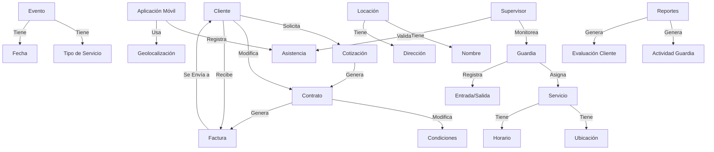

# Componentes del Sistema

Detalle de los componentes principales de Centurion.

```mermaid
graph TD
    Cliente["Cliente"]
    Guardia["Guardia"]
    Supervisor["Supervisor"]
    Cotizacion["Cotización"]
    Contrato["Contrato"]
    Factura["Factura"]
    Servicio["Servicio"]
    Evento["Evento"]
    Locacion["Locación"]
    AppMovil["Aplicación Móvil"]
    Reportes["Reportes"]

    Cliente -->|"Solicita"| Cotizacion
    Cliente -->|"Modifica"| Contrato
    Cliente -->|"Recibe"| Factura
    
    Guardia -->|"Asigna"| Servicio
    Guardia -->|"Registra"| EntradaSalida["Entrada/Salida"]
    
    Supervisor -->|"Monitorea"| Guardia
    Supervisor -->|"Valida"| Asistencia["Asistencia"]
    
    Cotizacion -->|"Genera"| Contrato
    
    Contrato -->|"Modifica"| Condiciones["Condiciones"]
    Contrato -->|"Genera"| Factura
    
    Factura -->|"Se Envía a"| Cliente
    
    Servicio -->|"Tiene"| Ubicacion["Ubicación"]
    Servicio -->|"Tiene"| Horario["Horario"]
    
    Evento -->|"Tiene"| TipoServicio["Tipo de Servicio"]
    Evento -->|"Tiene"| Fecha["Fecha"]
    
    Locacion -->|"Tiene"| Nombre["Nombre"]
    Locacion -->|"Tiene"| Direccion["Dirección"]
    
    AppMovil -->|"Registra"| Asistencia
    AppMovil -->|"Usa"| Geolocalizacion["Geolocalización"]
    
    Reportes -->|"Genera"| ActividadGuardia["Actividad Guardia"]
    Reportes -->|"Genera"| EvaluacionCliente["Evaluación Cliente"]
```

```mermaid
graph TD
    Cliente["Cliente"]
    Guardia["Guardia"]
    Supervisor["Supervisor"]
    Cotizacion["Cotización"]
    Contrato["Contrato"]
    Factura["Factura"]
    Servicio["Servicio"]
    Evento["Evento"]
    Locacion["Locación"]
    AppMovil["Aplicación Móvil"]
    Reportes["Reportes"]
    
    SolicitaCotizacion["Solicita Cotización"]
    ModificaContrato["Modifica Contrato"]
    RecibeFactura["Recibe Factura"]
    AsignaServicio["Asigna Servicio"]
    RegistraEntradaSalida["Registra Entrada/Salida"]
    MonitorearGuardia["Monitorea Guardia"]
    ValidaAsistencia["Valida Asistencia"]
    GeneraContrato["Genera Contrato"]
    ModificaCondiciones["Modifica Condiciones"]
    GeneraFactura["Genera Factura"]
    EnviaCliente["Se Envía al Cliente"]
    Ubicacion["Ubicación"]
    Horario["Horario"]
    TipoServicio["Tipo de Servicio"]
    Fecha["Fecha"]
    Nombre["Nombre"]
    Direccion["Dirección"]
    RegistraAsistencia["Registra Asistencia"]
    Geolocalizacion["Geolocalización"]
    ActividadGuardia["Actividad Guardia"]
    EvaluacionCliente["Evaluación Cliente"]

    Cliente --> SolicitaCotizacion
    Cliente --> ModificaContrato
    Cliente --> RecibeFactura
    Guardia --> AsignaServicio
    Guardia --> RegistraEntradaSalida
    Supervisor --> MonitorearGuardia
    Supervisor --> ValidaAsistencia
    Cotizacion --> GeneraContrato
    Contrato --> ModificaCondiciones
    Contrato --> GeneraFactura
    Factura --> EnviaCliente
    Servicio --> Ubicacion
    Servicio --> Horario
    Evento --> TipoServicio
    Evento --> Fecha
    Locacion --> Nombre
    Locacion --> Direccion
    AppMovil --> RegistraAsistencia
    AppMovil --> Geolocalizacion
    Reportes --> ActividadGuardia
    Reportes --> EvaluacionCliente
```

```mermaid
graph TD
    Cliente["Cliente"]
    Cotizacion["Cotización"]
    Servicio["Servicio"]
    Locacion["Locación"]
    
    SolicitaCotizacion["Solicita Cotización"]
    ModificaCotizacion["Modifica Cotización"]
    GeneradaParaCliente["Es Generada Para Cliente"]
    IncluyeServicios["Incluye Servicios"]
    IncluyeLocaciones["Incluye Locaciones"]
    TipoServicio["Tipo de Servicio"]
    CantidadGuardias["Cantidad de Guardias"]
    Horario["Horario"]
    Direccion["Dirección"]
    Nombre["Nombre"]

    Cliente --> SolicitaCotizacion
    Cliente --> ModificaCotizacion
    Cotizacion --> GeneradaParaCliente
    Cotizacion --> IncluyeServicios
    Cotizacion --> IncluyeLocaciones
    Servicio --> TipoServicio
    Servicio --> CantidadGuardias
    Servicio --> Horario
    Locacion --> Direccion
    Locacion --> Nombre
```    

