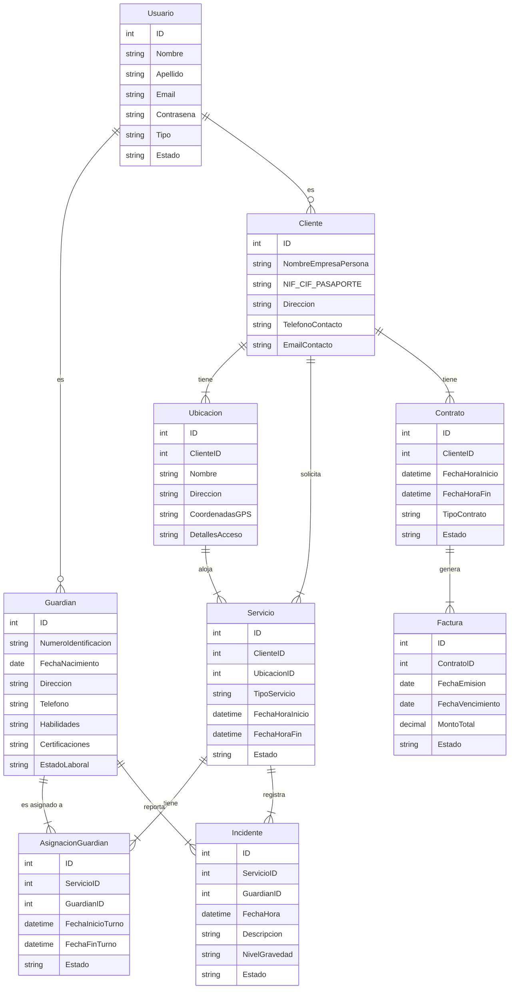

# Modelos de Datos

Descripción de los modelos de datos en Centurion.

```mermaid 
erDiagram
    Usuario ||--o{ Guardian : es
    Usuario ||--o{ Cliente : es
    Cliente ||--|{ Ubicacion : tiene
    Cliente ||--|{ Servicio : solicita
    Cliente ||--|{ Contrato : tiene
    Ubicacion ||--|{ Servicio : aloja
    Servicio ||--|{ AsignacionGuardian : tiene
    Guardian ||--|{ AsignacionGuardian : "es asignado a"
    Servicio ||--|{ Incidente : registra
    Guardian ||--|{ Incidente : reporta
    Contrato ||--|{ Factura : genera

    Usuario {
        int ID
        string Nombre
        string Apellido
        string Email
        string Contrasena
        string Tipo
        string Estado
    }

    Guardian {
        int ID
        string NumeroIdentificacion
        date FechaNacimiento
        string Direccion
        string Telefono
        string Habilidades
        string Certificaciones
        string EstadoLaboral
    }

    Cliente {
        int ID
        string NombreEmpresaPersona
        string NIF_CIF_PASAPORTE
        string Direccion
        string TelefonoContacto
        string EmailContacto
    }

    Ubicacion {
        int ID
        int ClienteID
        string Nombre
        string Direccion
        string CoordenadasGPS
        string DetallesAcceso
    }

    Servicio {
        int ID
        int ClienteID
        int UbicacionID
        string TipoServicio
        datetime FechaHoraInicio
        datetime FechaHoraFin
        string Estado
    }

    AsignacionGuardian {
        int ID
        int ServicioID
        int GuardianID
        datetime FechaInicioTurno
        datetime FechaFinTurno
        string Estado
    }

    Incidente {
        int ID
        int ServicioID
        int GuardianID
        datetime FechaHora
        string Descripcion
        string NivelGravedad
        string Estado
    }

    Contrato {
        int ID
        int ClienteID
        datetime FechaHoraInicio
        datetime FechaHoraFin
        string TipoContrato
        string Estado
    }

    Factura {
        int ID
        int ContratoID
        date FechaEmision
        date FechaVencimiento
        decimal MontoTotal
        string Estado
    }
```